# Cowork Value Intelligence: interpretation guide

This guide explains the question each page answers, how to read it, what the
signals may indicate, and what to verify before acting.

> The screenshots use fabricated sample data, `$75/hour` modeled labor value,
> and QA-only contract assumptions. They are not customer findings or benchmarks.

## Five safeguards before interpretation

1. Confirm the reporting period and active filters.
2. Check source availability in the report and the Glossary.
3. Distinguish observed, derived, modeled, and allocated values.
4. Corroborate unusual activity in the originating system.
5. Protect exported user, resource, organization, and consumption data.

## Metric confidence

| Label | Meaning | Safe wording |
| --- | --- | --- |
| Observed | Directly counted from a connected source field | “The connected export contains…” |
| Derived | Arithmetic over observed fields | “The report calculates…” |
| Modeled | Observed activity plus an assumption or customer input | “Under the selected assumptions…” |
| Allocated estimate | A total distributed across dimensions without source metering | “The modeled allocation suggests…” |
| Unavailable | Required source or input is absent | “This cannot be calculated from the current inputs.” |

## 1. Start Here

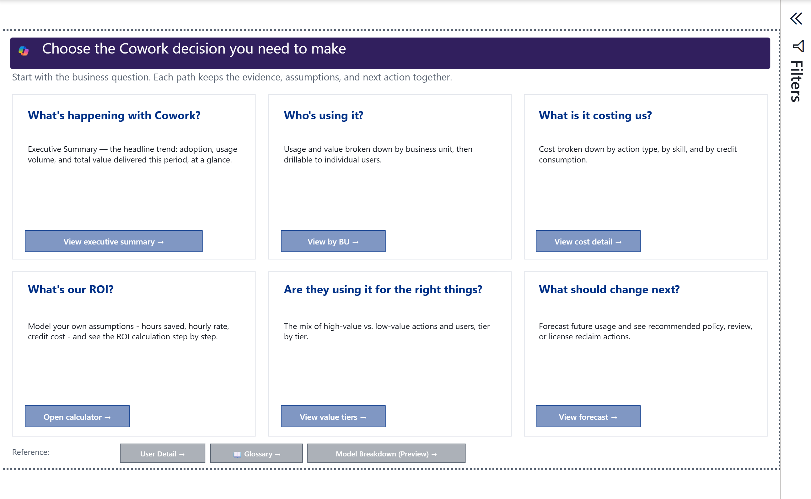

**Purpose:** Route a business question to the correct report page.

**How to read it:** Begin with the decision, not the metric. The six cards
separate adoption, audience, cost, ROI, work mix, and next actions.

**What this may indicate:** Different questions require different evidence.
Adoption can be available when billing or organization context is not.

**What to do next:** Select one route, then verify the page's data-status notes
before quoting a number.

## 2. Executive Summary

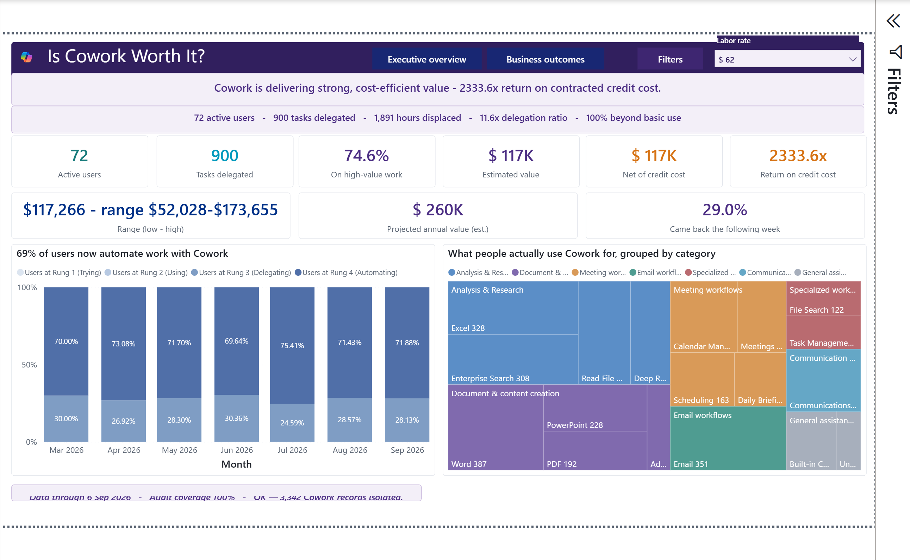

**Purpose:** Answer whether Cowork is being used and whether the selected value
and cost assumptions tell a favorable story.

**How to read it:** Read active users, delegated tasks, and work mix first.
Treat estimated value and ROI as scenario outputs. A synchronized labor rate
changes every value page.

**What this may indicate:** Growth plus a broad work mix can support further
enablement. Concentrated activity or a low-value mix can indicate coaching or
workflow-design opportunities.

**What to do next:** Confirm task reconciliation, labor rate, billing model, and
credit price with the appropriate owners before presenting the headline.

## 3. Activity & Value

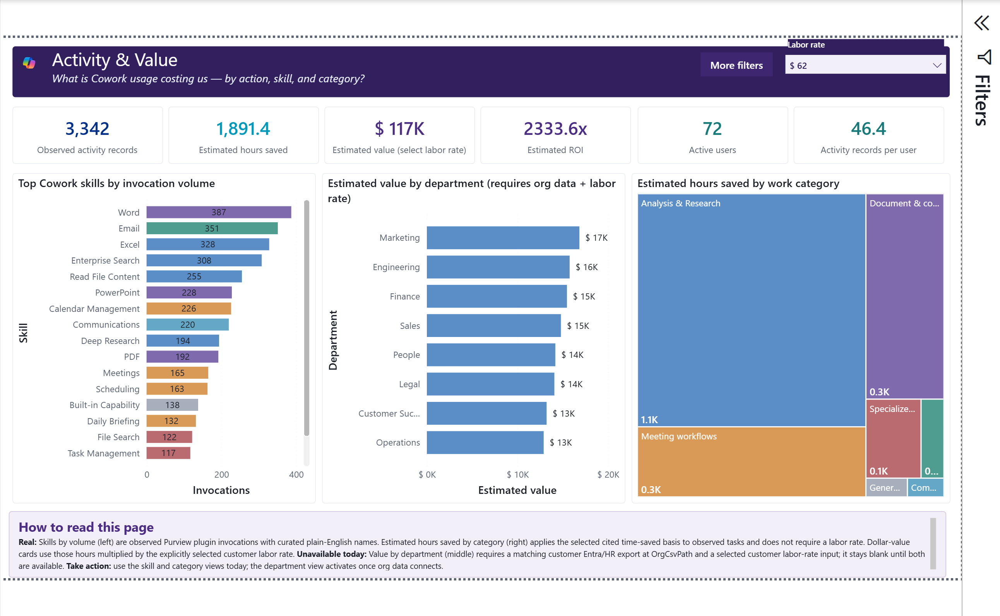

**Purpose:** Show which skills and departments contribute to modeled value.

**How to read it:** Skill invocations are observed. Estimated hours and dollars
combine observed task categories with cited typical-time estimates and the
selected labor rate.

**What this may indicate:** High-volume skills show where Cowork is embedded.
High modeled value shows where the selected assumptions assign more time savings.

**What to do next:** Validate the organization mapping, inspect the dominant
skills, and test a low/mid/high labor-rate scenario.

## 4. Actions

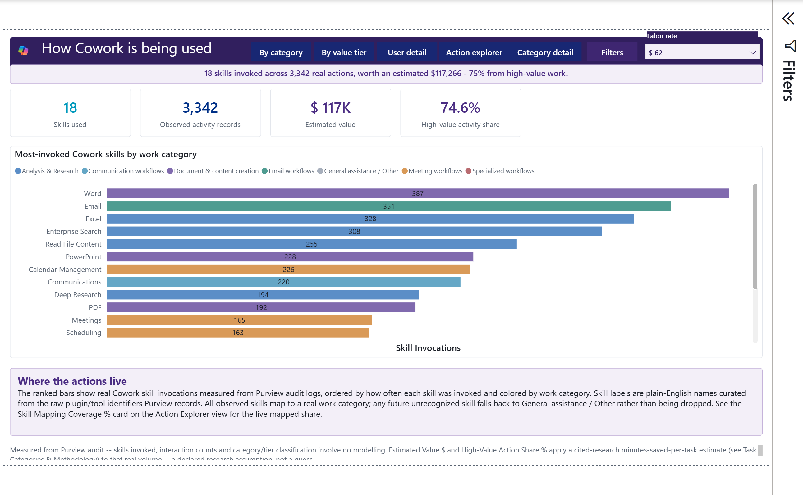

**Purpose:** Explain what Cowork did by skill, category, and value tier.

**How to read it:** The category and skill views are different grains. Skill
invocations are observed per plugin. Category value can repeat across multiple
skills in the same category because the source does not meter value per skill.

**What this may indicate:** A mature deployment usually moves beyond basic
assistance toward documented workflows, research, content, meetings, and
specialized actions.

**What to do next:** Review unmapped skills first, then use the category and
value-tier views for defensible rollups.

## 5. How Far They Delegate

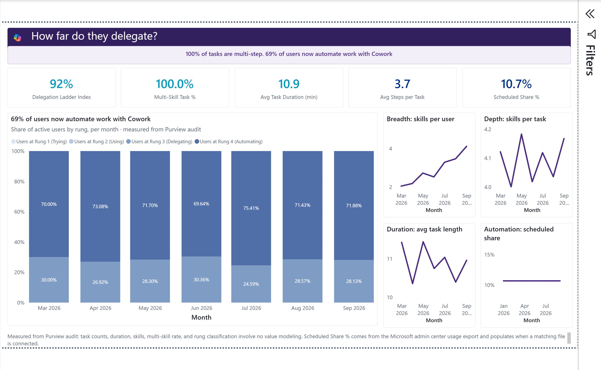

**Purpose:** Describe the depth and complexity of delegated work.

**How to read it:** Task duration is elapsed time from the first to last audit
record in a thread. Steps and skills are observed audit/plugin events. Long
duration does not prove unattended execution.

**What this may indicate:** More steps, longer threads, and skill chaining can
signal more complex delegation. They can also reflect retries or process friction.

**What to do next:** Sample the underlying thread and confirm business purpose
before describing a task as autonomous.

## 6. Value vs Cost

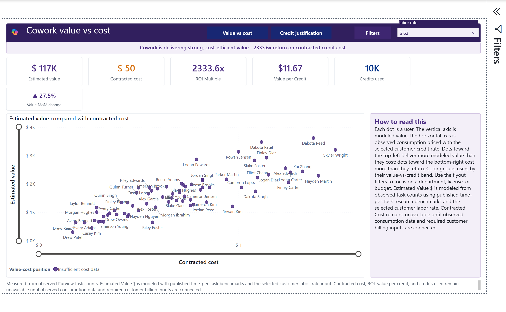

**Purpose:** Compare modeled value with connected and customer-priced consumption.

**How to read it:** Value is modeled. Credits used are observed from the
consumption export. Contracted cost and ROI depend on the selected rate and
billing model.

**What this may indicate:** Users above the diagonal in the scatter produce more
modeled value than allocated cost under the chosen assumptions.

**What to do next:** Re-run with Finance-approved inputs and review outliers at
the user-detail grain.

## 7. Methodology & Value Calculator

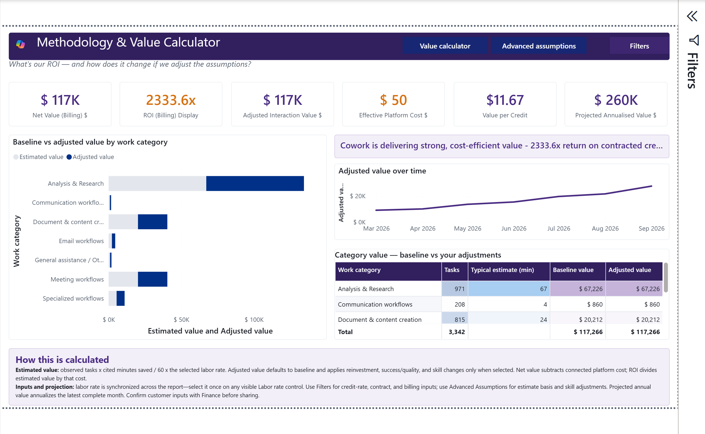

**Purpose:** Make every value assumption visible and adjustable.

**How to read it:** Baseline value equals observed category tasks multiplied by
the category's typical minutes saved, divided by 60, multiplied by labor rate.
Reinvestment, quality, and skill adjustments are optional scenarios.

**What this may indicate:** The range demonstrates assumption sensitivity, not
statistical confidence.

**What to do next:** Document the selected labor rate, estimate basis, billing
model, credit rate, and adjustment rationale with the exported result.

## 8. Consumption & Forecast

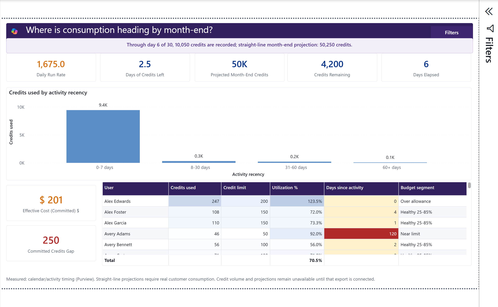

**Purpose:** Estimate where credit consumption is heading by month-end.

**How to read it:** Daily run rate and projected month-end credits use a
straight-line projection from elapsed days. Effective committed cost uses
customer commitment and price inputs.

**What this may indicate:** A positive commitment gap suggests projected overage;
a negative gap suggests under-utilization.

**What to do next:** Check data freshness and expected seasonality before
changing a commitment.

## 9. BU Showback

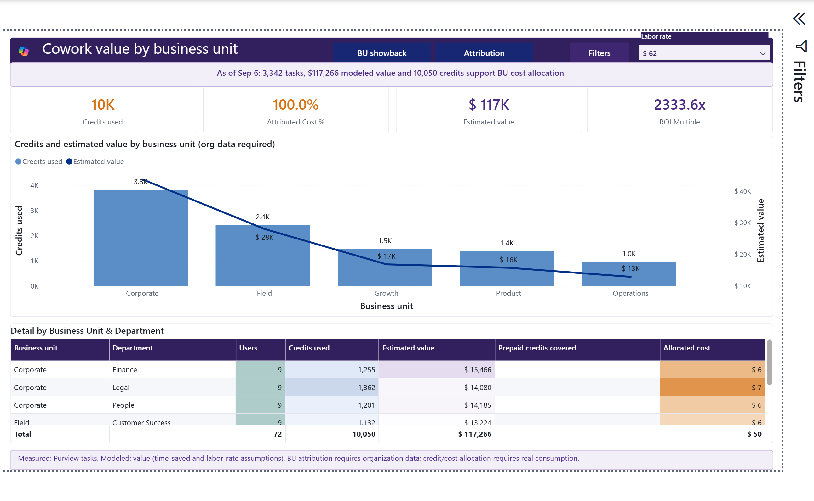

**Purpose:** Attribute consumption and modeled value to business units.

**How to read it:** Organization fields come from the customer export. Cost
allocation follows the selected allocation rule and is not invoice metering.

**What this may indicate:** A unit can have high consumption, high value, both,
or neither. Read credits and value together.

**What to do next:** Confirm cost-center ownership and allocation policy with
Finance before circulating showback figures.

## 10. Value by User Tier

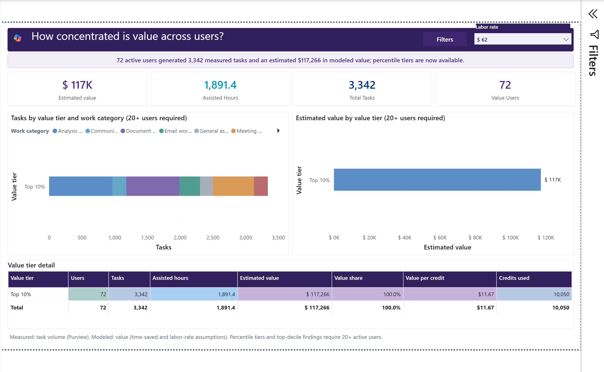

**Purpose:** Show how concentrated tasks and modeled value are across users.

**How to read it:** Percentile tiers require at least 20 users. The current
sample supports the full tier calculation.

**What this may indicate:** High concentration can identify champions or
single-point dependency. Broad distribution can indicate scaled adoption.

**What to do next:** Pair tier results with business-unit and work-category
context before targeting enablement.

## 11. Right-Sizing & Reclaim

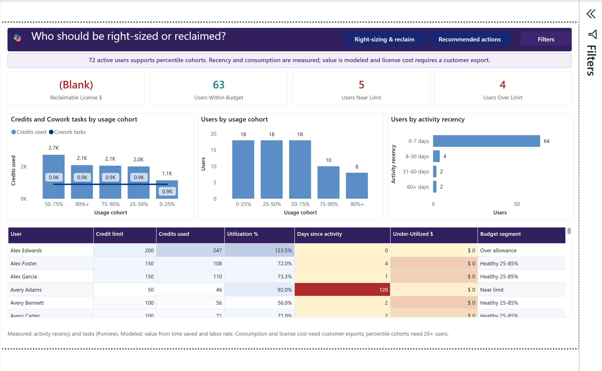

**Purpose:** Identify utilization, recency, and budget exceptions.

**How to read it:** Near-limit and over-limit counts use observed consumption
against allowance. Reclaimable license dollars remain unavailable until a
license assignment and customer seat price are connected.

**What this may indicate:** Over-limit users can need a higher allowance or a
workflow review. Low-use or inactive users can warrant follow-up, not automatic
license removal.

**What to do next:** Confirm role, leave status, workload seasonality, and license
terms before changing access.

## 12. Model & LLM Breakdown

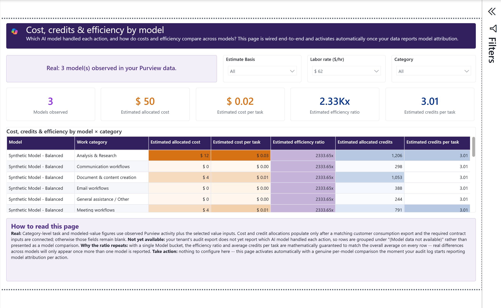

**Purpose:** Show model-attributed activity and modeled cost/efficiency by work
category when Purview emits model attribution.

**How to read it:** Model names are observed from `ModelTransparencyDetails`.
Current credits and cost are allocated estimates based on task/value shares;
they are not model-specific billing meters. The synthetic sample model names are
deliberately labeled as synthetic.

**What this may indicate:** Differences can guide a measurement plan, but the
current allocation cannot prove that one model consumes fewer credits.

**What to do next:** Add source-backed per-model metering before recommending a
model on cost. Use observed thread duration only after a reliable thread-to-model
mapping exists.

## 13. Glossary

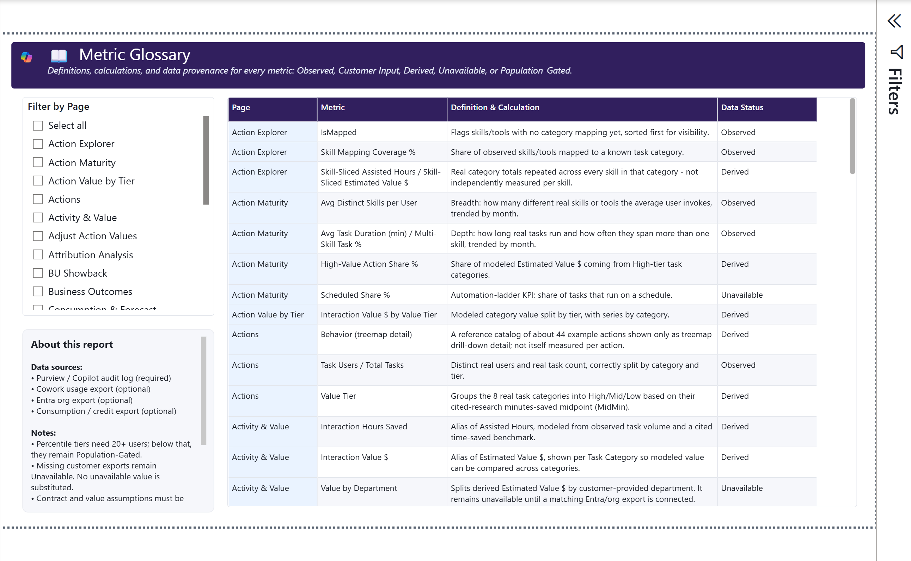

**Purpose:** Define every metric and disclose its data status.

**How to read it:** Filter by page, metric, or data status. Use the
definition and status together.

**What this may indicate:** “Unavailable” describes a missing dependency, not
zero activity. “Modeled” requires the selected assumptions to travel with the
number.

**What to do next:** Copy the metric definition, period, filters, and confidence
label into any presentation or decision record.

## Usage and compliance disclaimer

Coverage depends on licensing, audit settings, retention, product behavior,
permissions, export completeness, and identity matching. The report can contain
false positives, false negatives, incomplete model attribution, and estimates.
It does not inspect prompt content, prove intent, establish causality, replace
official billing, or authorize personnel action.

Customers control collection, storage, sensitivity labels, access, retention,
publication, and lawful use of their data. The repository's sample package is
fabricated and sends no customer data to GitHub.
