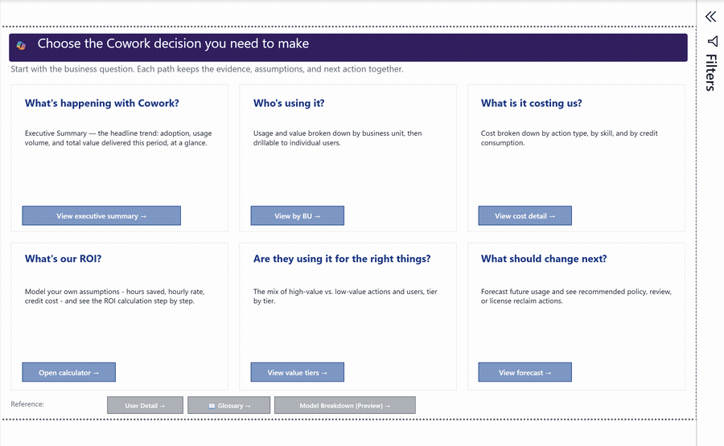

# Cowork Intelligence Templates

<div align="center">


Two data-free Microsoft 365 Copilot Cowork templates for adoption, champions,
delegated work, modeled value, consumption, and right-sizing analysis.

</div>

> **In Testing:** These templates are planning and interpretation aids, not billing
> system, financial audit, product SLA, or basis for personnel action. Value uses
> observed task activity plus published time-saved assumptions and customer-selected
> inputs. Cost and ROI require matching customer consumption and contract inputs.

<div align="center">

</div>

> 🎬 **Cowork Value Intelligence Walkthrough (video):** an executive tour of
> adoption, delegated work, workflow maturity, champions, and transparent value.
>
> https://github.com/user-attachments/assets/d821a3dd-7646-4529-aec5-5a36211060de

## Choose the template

The recommended Value release is V1.3 Friendly Skills in local-folder and
SharePoint-folder editions. Both preserve the original 12-page layout and value
logic while rendering unmapped technical tool identifiers as readable labels.
The replaced V1 local and V1.2 SharePoint artifacts are preserved unchanged in
the [pre-V1.3 backup folder](value/backups/2026-09-18-pre-v1.3-friendly-skills/)
for rollback and reproducibility.

| Template | Best for | Pages and setup | Status |
| --- | --- | --- | --- |
| [`adoption/Cowork Adoption Intelligence v2 Testing.pbit`](adoption/Cowork%20Adoption%20Intelligence%20v2%20Testing.pbit) | Activation, sustained usage, potential champions, action patterns, and delegation maturity; core pages do not require consumption | Nine visible pages; one `DataFolderPath` parameter | `2.0.1-testing` |
| [`value/Cowork Value V1.3 Friendly Skills Testing.pbit`](value/Cowork%20Value%20V1.3%20Friendly%20Skills%20Testing.pbit) | Recommended local Value template with readable skill/tool names | 11 viewer-facing pages plus one hidden assumptions page; one `DataFolderPath` parameter | `1.3.0-friendly-skills-testing` |
| [`value/Cowork Value V1.3 SharePoint Friendly Skills Testing.pbit`](value/Cowork%20Value%20V1.3%20SharePoint%20Friendly%20Skills%20Testing.pbit) | Recommended SharePoint Value template with readable skill/tool names and current/legacy Purview support | Same pages; `SharePointSiteUrl` plus `SharePointFolderUrl`; visible readiness diagnostic | `1.3.0-sharepoint-friendly-skills-testing` |
| [`value/backups/2026-09-18-pre-v1.3-friendly-skills/Cowork Value V1 Testing.pbit`](value/backups/2026-09-18-pre-v1.3-friendly-skills/Cowork%20Value%20V1%20Testing.pbit) | Backed-up local Value baseline | Same pages; one `DataFolderPath` parameter | `1.1.0-testing` |
| [`value/backups/2026-09-18-pre-v1.3-friendly-skills/Cowork Value V1.2 SharePoint Testing.pbit`](value/backups/2026-09-18-pre-v1.3-friendly-skills/Cowork%20Value%20V1.2%20SharePoint%20Testing.pbit) | Backed-up SharePoint baseline | Same pages; `SharePointSiteUrl` plus `SharePointFolderUrl` | `1.2.0-sharepoint-testing` |
| [`value/Cowork Value V1 SharePoint Testing.pbit`](value/Cowork%20Value%20V1%20SharePoint%20Testing.pbit) | Previous SharePoint revision retained for reproducibility | Same pages and parameters; legacy Purview outer columns only | `1.1.0-sharepoint-testing` |

Use the [shared data setup guide](DATA_SETUP_START_HERE.md) for the exact sample
and production workflow for the template you choose.

## Release kit

| Resource | Open or download |
| --- | --- |
| Recommended Value testing template | [`value/Cowork Value V1.3 Friendly Skills Testing.pbit`](value/Cowork%20Value%20V1.3%20Friendly%20Skills%20Testing.pbit) |
| Recommended Value SharePoint testing template | [`value/Cowork Value V1.3 SharePoint Friendly Skills Testing.pbit`](value/Cowork%20Value%20V1.3%20SharePoint%20Friendly%20Skills%20Testing.pbit) |
| Backed-up Value testing template | [`value/backups/2026-09-18-pre-v1.3-friendly-skills/Cowork Value V1 Testing.pbit`](value/backups/2026-09-18-pre-v1.3-friendly-skills/Cowork%20Value%20V1%20Testing.pbit) |
| Backed-up Value SharePoint testing template | [`value/backups/2026-09-18-pre-v1.3-friendly-skills/Cowork Value V1.2 SharePoint Testing.pbit`](value/backups/2026-09-18-pre-v1.3-friendly-skills/Cowork%20Value%20V1.2%20SharePoint%20Testing.pbit) |
| Legacy Value SharePoint testing template | [`value/Cowork Value V1 SharePoint Testing.pbit`](value/Cowork%20Value%20V1%20SharePoint%20Testing.pbit) |
| Value setup | [`value/README.md`](value/README.md) |
| Adoption testing template | [`adoption/Cowork Adoption Intelligence v2 Testing.pbit`](adoption/Cowork%20Adoption%20Intelligence%20v2%20Testing.pbit) |
| Adoption setup | [`adoption/README.md`](adoption/README.md) |
| Optional example package | [`release/Cowork-Value-Intelligence-Sample-Data.zip`](release/Cowork-Value-Intelligence-Sample-Data.zip) |
| Data setup | [`DATA_SETUP_START_HERE.md`](DATA_SETUP_START_HERE.md) |
| Security roles | [`docs/SECURITY_ROLES.md`](docs/SECURITY_ROLES.md) |
| Interpretation guide | [`INTERPRETATION_GUIDE.md`](INTERPRETATION_GUIDE.md) |
| Interpretation storyboard | [`PPTX`](Cowork%20Value%20Intelligence%20V1.0%20In%20Testing%20-%20Interpretation%20Storyboard.pptx) |
| Narrated walkthrough | [`MP4`](media/Cowork-Value-Intelligence-Walkthrough.mp4) · [`Transcript`](media/Cowork-Value-Intelligence-Walkthrough-transcript.md) · [`Subtitles`](media/Cowork-Value-Intelligence-Walkthrough.srt) · [`Build notes`](media/README.md) |
| Editable source | [`src/`](src/) · [`Model blueprint`](docs/MODEL_BLUEPRINT.md) |

## Why use this report

- See who is using Cowork and how usage changes over time.
- Understand which skills and work categories are being delegated, with readable
  fallback labels even when a tenant emits a previously unseen technical tool ID.
- Model labor value with a transparent, adjustable calculation.
- Compare projected cost under Credit-Priced, License-Included, Prepaid, Hybrid,
  and Monthly Committed billing assumptions.
- Reconcile Purview task threads with the Microsoft admin center usage export.
- Explore consumption, forecast month-end credits, and identify budget exceptions.
- Compare model-attributed activity when Purview supplies model transparency data.

The Value template uses Microsoft's
[`CreditUsage`](https://github.com/microsoft/CreditUsage) Cowork chargeback
template as the reference for per-user allowance and overage logic. One user's
unused allowance does not offset another user's overage. This release extends
that foundation with five selectable planning modes and value/ROI analysis; it
does not replace official billing records.

## Microsoft chargeback reference preview

[](https://github.com/microsoft/CreditUsage/blob/main/images/dashboard-preview.gif)

*Official Microsoft `CreditUsage` reference dashboard preview, shown for
provenance. It is not a screenshot of the extended Cowork Value report in this
repository. Source: [Microsoft `CreditUsage`](https://github.com/microsoft/CreditUsage)
(MIT).*

The published PBITs contain no embedded customer or example data. They come to
life with your approved organization exports. Repository screenshots demonstrate
the report layout with de-identified example records.

## Start here

| Goal | Next step |
| --- | --- |
| Tour the report safely | Download `release/Cowork-Value-Intelligence-Sample-Data.zip`, then follow [Path A](DATA_SETUP_START_HERE.md#path-a-test-with-fabricated-sample-data). |
| Connect tenant data | Follow the [customer export path](DATA_SETUP_START_HERE.md#path-b-connect-customer-exports). |
| Request least-privilege access | Use the [security role matrix](docs/SECURITY_ROLES.md). |
| Interpret a page | Open the [Interpretation Guide](INTERPRETATION_GUIDE.md). |
| Rebuild or customize | Open the PBIP under [`src/`](src/) and read the [Model Blueprint](docs/MODEL_BLUEPRINT.md). |
| Watch the walkthrough | Open [`media/Cowork-Value-Intelligence-Walkthrough.mp4`](media/Cowork-Value-Intelligence-Walkthrough.mp4). |

## Prerequisites

| Scenario | What you need |
| --- | --- |
| Sample evaluation | Windows and a current [Power BI Desktop](https://powerbi.microsoft.com/desktop/) |
| Production activity | Raw Purview Audit Search CSV exports from a Purview `Audit Reader` |
| Usage reconciliation | Cowork usage details CSV from a `Reports Reader` |
| Cost and ROI | **Cost Management > Consumption > Users** CSV from an `AI Reader`, plus Finance-approved inputs |
| Organization views | Optional normalized export from the authorized HR or Identity data owner |
| Power BI publication | Power BI Pro/PPU unless qualifying capacity applies; workspace `Contributor` or higher; gateway access for scheduled refresh from local files |

The current release uses exported CSV files. It does **not** require an app
registration, client secret, Microsoft Graph application permission, or Defender
role. See [Security roles and access](docs/SECURITY_ROLES.md).

## Explore with sample data

Follow [Path A in the setup guide](DATA_SETUP_START_HERE.md#path-a-test-with-fabricated-sample-data).
The generated sample files are already included; Python is required only when
you want to regenerate them.

The release screenshots use a `$75/hour` labor assumption and QA-only sample
contract values. These are demonstration inputs, not recommendations.

## Production setup

The templates support five customer-owned inputs:

| Input | Required | Minimum access | Purpose |
| --- | --- | --- | --- |
| Purview audit CSV folder | Yes, all templates | Purview `Audit Reader` role group | Task threads, skills, resources, duration, and optional model attribution |
| Cowork usage CSV | Recommended | `Reports Reader` | Reported tasks, scheduled split, active days, and reconciliation |
| Cost Management user-consumption CSV | Required for credit, cost, and ROI views | `AI Reader` | Credit allowance, credits used, sessions, recency, cost, and ROI |
| Organization CSV | Optional | Existing authorized HR/Identity access | Department, business unit, manager, role, and geography |
| `cowork_users.csv` | Optional | Existing authorized Identity access | Friendly display-name enrichment |

The **Reports > Usage > Microsoft Copilot > Credits** CSV is a different report
and does not contain the template's required consumption fields. Do not use it
as `CoworkConsumptionDetails.csv`.

Do not upload customer exports to this repository. Keep tenant files outside the
Git working tree and use the included `.gitignore` as a second line of defense.
The complete click-by-click production workflow is
[Path B in the setup guide](DATA_SETUP_START_HERE.md#path-b-connect-customer-exports).

## Legacy combined-source reference

The original combined PBIT is no longer distributed in the active repository.
Its editable PBIP source and supporting interpretation assets remain for
reference; the release binary is retained only as a local backup.

The source is provided in Power BI Project format:

```text
src/
  Cowork Value Intelligence.pbip
  Cowork Value Intelligence.Report/
  Cowork Value Intelligence.SemanticModel/
```

1. Clone the repository to Windows.
2. Open `src\Cowork Value Intelligence.pbip` in Power BI Desktop.
3. Follow [Path B](DATA_SETUP_START_HERE.md#path-b-connect-customer-exports)
   to collect, normalize, and validate the customer exports.
4. In **Transform data > Manage parameters**, replace the portable
   `C:\CoworkValueIntelligence\...` values with the protected input paths.
5. Keep `DataSourceMode` as `MAC-CSV`.
6. Set `AsOfDate` to the snapshot date of the consumption export.
7. Set `CurrencyCode` to the reporting currency and review
   `DefaultRatePerCredit`. Use only a Finance-approved rate when interpreting
   cost or ROI.
8. Refresh and resolve any privacy-level prompt using organizational privacy
   settings approved by your administrator.
9. Validate every source in the order documented in the setup guide.
10. Validate every page using the [release checklist](docs/RELEASE_CHECKLIST.md).
11. Save as a new PBIP or export a PBIT. Never commit `.pbi` local state.

The report definition contains 13 pages, 35 semantic-model tables, synchronized
labor-rate selectors, and transparent source-status messages. Optional files
degrade to unavailable states instead of substituting customer data. The
Purview folder is a hard dependency and must exist.

## Report pages

1. **Start Here** — routes each business question to the correct page.
2. **Executive Summary** — adoption, task volume, value, ROI, and work mix.
3. **Activity & Value** — skills, departments, and modeled hours/value.
4. **Actions** — category, skill, tier, and action-explorer views.
5. **How Far They Delegate** — task depth, duration, steps, and skill chaining.
6. **Value vs Cost** — customer cost inputs, ROI, and spend/value comparison.
7. **Methodology & Value Calculator** — the complete calculation and assumptions.
8. **Consumption & Forecast** — run rate, month-end projection, and budget segments.
9. **BU Showback** — business-unit usage, value, and allocated cost.
10. **Value by User Tier** — concentration and percentile-based value bands.
11. **Right-Sizing & Reclaim** — utilization cohorts, recency, and budget exceptions.
12. **Model & LLM Breakdown** — model-attributed cost allocation and efficiency.
13. **Glossary** — metric definitions, confidence, ownership, and availability.

## Metric confidence

- **Observed:** calculated from connected source records.
- **Derived:** arithmetic over observed fields.
- **Modeled:** observed activity combined with published assumptions or customer inputs.
- **Allocated estimate:** a total spread across categories/models; not source metering.
- **Unavailable:** required data or customer input is absent.

Always include the reporting period, filters, data status, and confidence label
when sharing a number outside the report.

## Repository structure

```text
adoption/
  Cowork Adoption Intelligence v2 Testing.pbit
  README.md
build_sample_data.py
DATA_SETUP_START_HERE.md
INTERPRETATION_GUIDE.md
README.md
SECURITY.md
docs/
  SECURITY_ROLES.md
images/report-pages/
media/
release/
sample_data/
src/
tools/
value/
  Cowork Value V1.3 Friendly Skills Testing.pbit
  Cowork Value V1.3 SharePoint Friendly Skills Testing.pbit
  Cowork Value V1 SharePoint Testing.pbit
  README.md
  backups/
    2026-09-18-pre-v1.3-friendly-skills/
      Cowork Value V1 Testing.pbit
      Cowork Value V1.2 SharePoint Testing.pbit
  tools/
    New-CoworkValueFriendlyNamesTemplate.ps1
    New-CoworkValueSharePointTemplate.ps1
```

## Security and privacy

Purview audit exports can contain user identifiers, resource URLs, and other
tenant information. Follow [SECURITY.md](SECURITY.md), the
[least-privilege role matrix](docs/SECURITY_ROLES.md), your organization's data
handling requirements, and Microsoft 365 retention and access policies.

Repository visibility and file classification are separate controls. This
repository is public. The distributable PBITs contain no imported data or
machine-bound security binding and carry the tenant **Public** sensitivity
label without encryption. Apply or confirm the label required by organizational
policy before sharing a refreshed report.

## Limitations

- Purview coverage depends on licensing, retention, permissions, and emitted fields.
- The admin center export is user-level aggregate data, not an event timeline.
- Scheduled/user-initiated task split comes only from the admin center usage export.
- Model attribution can be absent even when Cowork activity is present.
- The current Model & LLM Breakdown can show `(Model data not available)` because
  Cowork audit records don't currently provide model-specific names.
- Current model cost by LLM is an allocated estimate, not model-specific billing.
- The Microsoft Copilot Credits usage-report CSV is not compatible with the
  Cost Management user-consumption schema required by this release.
- Reclaimable license dollars remain unavailable without a license assignment
  and customer-provided seat cost.
- Task duration is elapsed time between the first and last audit event in a thread,
  not measured human attention.

## Release status

The active Value template is `1.1.0-testing`, and Adoption is `2.0.1-testing`.
Review
[CHANGELOG.md](CHANGELOG.md), [`value/docs/RELEASE_CHECKLIST.md`](value/docs/RELEASE_CHECKLIST.md),
and [`adoption/docs/RELEASE_CHECKLIST.md`](adoption/docs/RELEASE_CHECKLIST.md)
before distribution.
